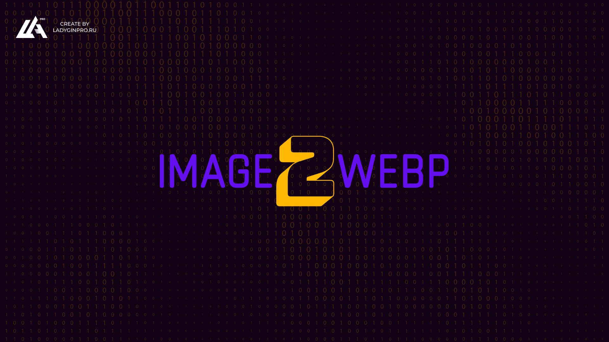

# Convert images to webp

### Requirements

1. Node.js
2. Yarn

### How to use

1. Open terminal and install packages:

   - yarn install
   - Run command: yarn start
   - Done

### Options:

```js
Argumetns Variables:
  sourceDir: 'folder for source images', // string
  outputDir: null or 'folder for webp images', // null or string
  // if (outputDir === null) outputDir = current image folder
  subDir: null or 'sub folder for source images relative sourceDir', // null or string
  webpQuality: 'compress quality', // number
  fileTypes: 'allow file types', // string
  findDeep: 'search recursively in subfolders', // boolean
```

### Examples

```js
  CHANGE SOURCE DIR

  yarn start --sourceDir='./example/'

  Result:
  `===  Start  ===
  In folder "example" - webp created!
  {
    sourceDir: ./example/,
    outputDir: null,
    subDir: undefined,
    quality: 90,
    fileTypes: 'jpg, png',
    findDeep: true,
  }
  ===  End  ===`
```

```js
  IGNORE RECURSIVE

  yarn start --findDeep=''

  Result:
  `===  Start  ===
  In folder "images" - webp created!
  {
    sourceDir: ./images/,
    outputDir: null,
    subDir: undefined,
    quality: 90,
    fileTypes: 'jpg, png',
    findDeep: 'ignore',
  }
  ===  End  ===`
```

```js
  CHANGE QUALITY

  yarn start --quality=50

  Result:
  `===  Start  ===
  In folder "images" - webp created!
  {
    sourceDir: ./images/,
    outputDir: null,
    subDir: undefined,
    quality: 50,
    fileTypes: 'jpg, png',
    findDeep: true,
  }
  ===  End  ===`
```
